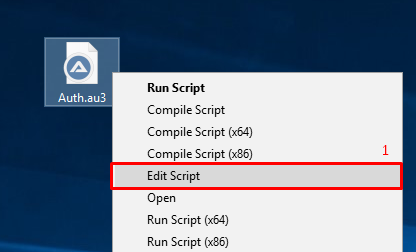
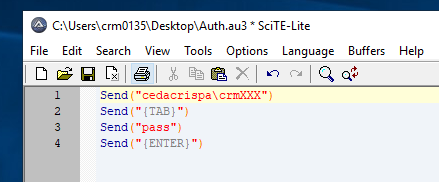
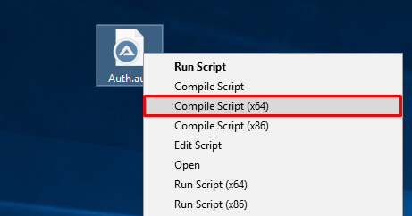
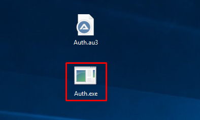

# Route link renaming automation on Sharepoint


## Features

- Auth via AutoIt tool
- Renaming of links on sharepoint via Selenium Automation tool

## Installation

Install the dependencies:

```sh
pip install -r requirements.txt
```

## Requirement tool!

AutoIt used for pass basic http authentication whose username contains special characters like "\"

| Tool | Link to download |
| ------ | ------ |
| AutoIt | https://www.autoitscript.com/site/autoit/downloads/|


## Guide how to use AutoIT

When AutoIT tool installed on your desktop open Auth.au3 file with AutoIt Editor and write your username and password:



* Modify username and password and save script.



* Compile that script:



* Move Auth.exe file in project folder:



* Run script...

```sh
python main.py
```

###**Don't minimize or close browser until the user is authenticated!**

- ✨Magic ✨

Want to contribute? Great! Waiting for pull request.

